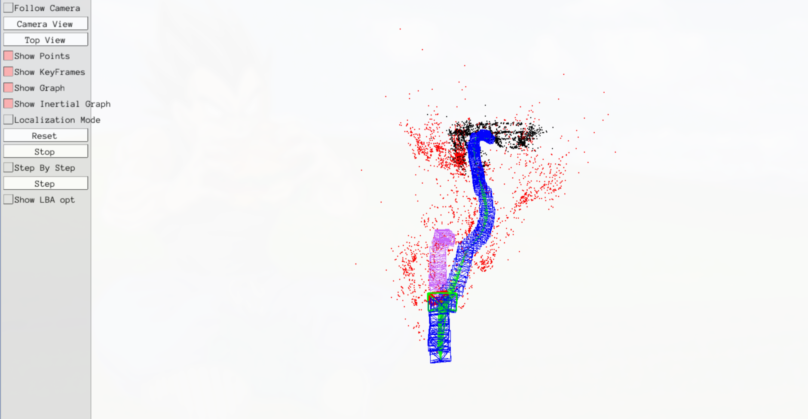
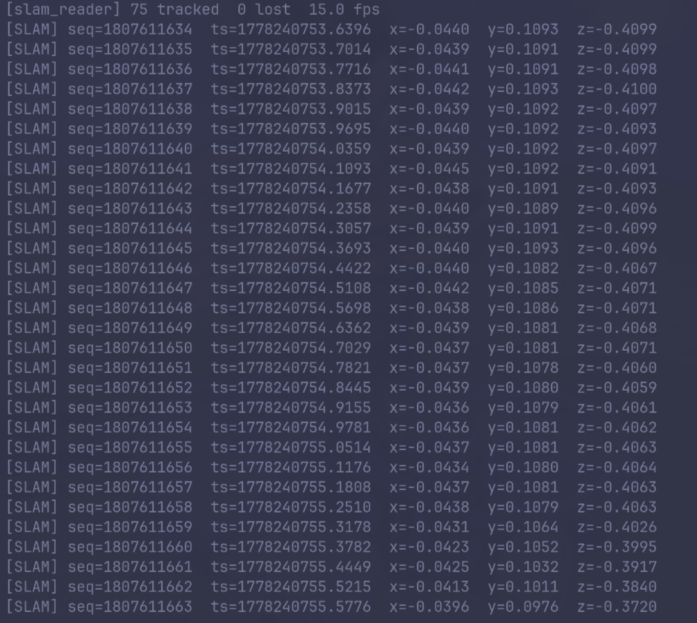
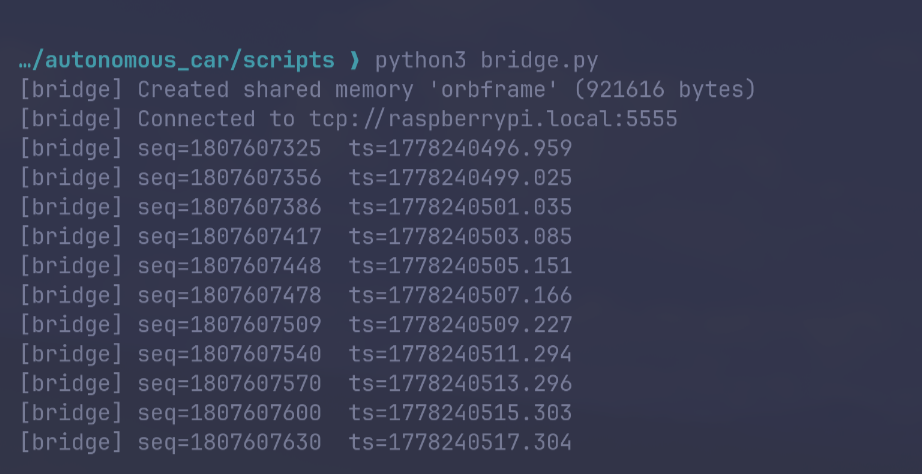
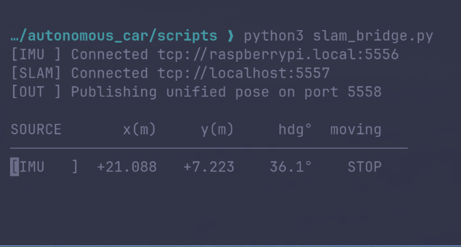
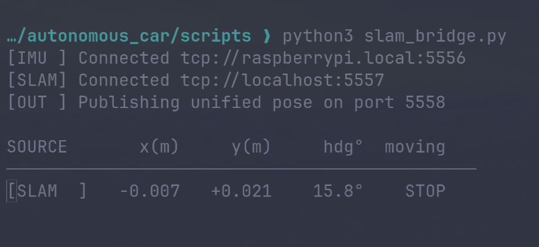

# PC SLAM Processing Layer: High-Performance C++ Pipeline

<p align="center">
  
  
  <br>
  <em>Execution Logs: Real-time ORB-SLAM3 trajectory generation and tracking via C++ execution node.</em>
</p>

This directory represents the high-performance computation tier, executing locally on the primary PC. It receives compressed hardware data from the Raspberry Pi over the local network via **ZeroMQ (ZMQ)** and translates this into trajectory generation utilizing **ORB-SLAM3**.

## 🏎️ Zero-Copy Data Transfer Mechanism & Shared Memory (IPC)

To ensure ultra-low latency and avoid disk I/O bottlenecks, this pipeline utilizes a **"Zero-Copy"** data transfer mechanism bridging Python and C++ seamlessly. 

The logic operates using **POSIX Shared Memory (SysV IPC)**:
1. **ZMQ Consumer (`bridge.py`)**: The Python node receives the compressed JPEG frames over the network via ZMQ from the Raspberry Pi, decodes them, and writes the raw image arrays directly into a designated POSIX shared memory block.

<p align="center">
  
  <br>
  <em>System Verification: Memory segment allocation and JPEG stream decoding verified via bridge diagnostic output.</em>
</p>
2. **C++ Tracking Loop (`slam_reader.cc`)**: The high-performance C++ executable attaches to this exact shared memory segment. Instead of copying image buffers back and forth, `slam_reader.cc` reconstructs an OpenCV `cv::Mat` directly pointing to the shared memory address space. 
3. This unbuffered approach guarantees the main ORB-SLAM3 monocular tracking loop accesses real-time frames instantly, maintaining the required 30fps without IPC overhead.

## 📄 Camera Calibration & Configuration (`picam.yaml`)

Robust monocular SLAM strictly depends on perfect intrinsic and distortion modeling. The `picam.yaml` file is the critical configuration artifact derived from checkerboard calibration mappings. It embeds the precise hardware constants for the Raspberry Pi Camera V2 (IMX219):

* **Intrinsic Parameters**: Focal lengths (`fx`, `fy`) describe the lens projection scale, while the principal points (`cx`, `cy`) track the optical center.
    * `fx` = 509.7646
    * `fy` = 515.5453
    * `cx` = 325.8610
    * `cy` = 239.5761
* **Distortion Parameters (Plumb Bob)**: Corrects structural lens warps (barrel and pincushion distortions).
    * `k1` = 0.232565
    * `k2` = -0.490644
    * `p1` = 0.002399
    * `p2` = 0.004479
    * `k3` = 0.302230

Without these exact specifications, the ORB-SLAM3 engine's trajectory scale would exhibit significant drift.

## 🛠️ Arch Linux Build Requirements

Compiling this C++ executable on Arch Linux requires linking against several heavy-duty graphical and mathematical libraries:

```bash
# Core Arch dependencies for C++ Pipeline
sudo pacman -S cmake gcc opencv eigen pangolin zeromq
```

* **OpenCV 4.x**: Crucial for `cv::Mat` frame handling, decoding, and feature extraction.
* **Pangolin**: Required by ORB-SLAM3 for the 3D trajectory viewer and GUI.
* **Eigen3**: Strictly required for the heavy Lie algebra (Sophus) operations, underlying pose matrix (SE3) transformations, and map point triangulation inside SLAM.

### Compilation

```bash
mkdir build && cd build
cmake ..
make -j$(nproc)
```

## 📁 Core Files
*   `bridge.py`: Network consumer pulling ZMQ frames and bridging to IPC SysV.
*   `slam_reader.cc`: Main C++ tracking loop mapping the shared memory and pushing raw frames directly to ORB-SLAM3. 
*   `CMakeLists.txt`: Links the executable to `libORB_SLAM3.so`, OpenCV 4.x, and Eigen.
*   `picam.yaml`: The definitive camera calibration matrix settings.


## SLAM & IMU Data Fusion

Asynchronous data streams are integrated logically into unified pose estimates:

<p align="center">
  
  
  <br>
  <em>Real-time Telemetry: Consolidated visual tracking states mapped onto inertial IMU vectors for stable localization.</em>
</p>
